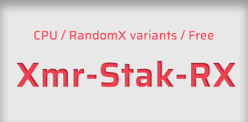
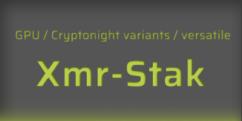
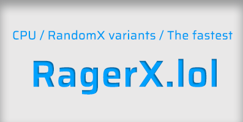
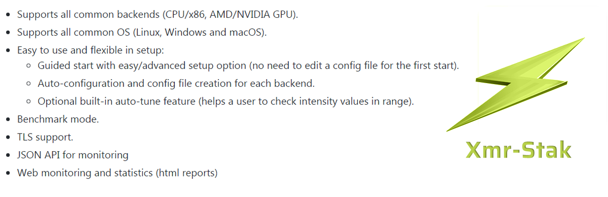
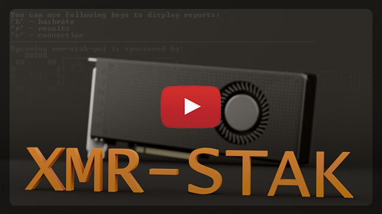

<table>
    <tr>
        <td align="center"><a href=https://github.com/fireice-uk/xmr-stak/tree/xmr-stak-rx/doc/README.md></a></td>
        <td align="center"><a href=#></a></td>
        <td align="center"><a href=https://ragerx.lol></a></td>
    </tr>
</table>

<table>
    <tr>
        <td align="center"><a href=#features-overview></a></td>
        <td align="center"><a href=#supported-coins-and-algorithms></a></td>
        <td align="center"><a href=#get-miner></a></td>
        <td align="center"><a href=#additional-guides-and-feedback></a></td>
        <td align="center"><a href=#default-developer-donation></a></td>
    </tr>
</table>

 <table>
     <tr>
         <td align="center"><a href=usage.md></a></td>
         <td align="center"><a href=compile/compile.md></a></td>
         <td align="center"><a href=tuning.md></a></td>
         <td align="center"><a href=troubleshooting.md></a></td>
         <td align="center"><a href=FAQ.md></a></td>
     </tr>
 </table>

## Introduction
XMR-Stak is a universal open source stratum pool miner. This miner supports CPUs, AMD and NVIDIA GPUs and can be used for mining various crypto currencies: Ryo, Graft, Bittube, Conceal, Haven and many more Cryptonight coins.

## Features overview
[](#)

## Supported coins and algorithms
Xmr-Stak supports various variants of Cryptonight algorithm. Use one of the following options (type this coin alias in either `pool.txt` config file or on startup configuration under `"currency"` parameter and miner will pick it's variant of Cryptonight algorithm for mining):

|  |  |  |
| ---  | ---  | --- |
| [BitTube](https://coin.bit.tube/) | [Plenteum](https://www.plenteum.com/) |  |
| [Conceal](https://conceal.network) | [QRL](https://theqrl.org) |  |
| [Graft](https://www.graft.network) | [Ryo](https://ryo-currency.com)  | **Atom Wallet Solo mining mode is sponsored by [RYO](https://ryo-currency.com/)** |
| [Haven](https://havenprotocol.com) | [X-CASH](https://x-network.io/) |  |
| [Lethean](https://lethean.io) | [Zelerius](https://zelerius.org/) |  |
| [Masari](https://getmasari.org) |  |  |


**[Ryo Currency](https://ryo-currency.com)** - is a way for us to implement the ideas that we were unable to in
Monero. See [here](https://github.com/fireice-uk/cryptonote-speedup-demo/) for details.

If your preferred coin is not listed, you can choose one of the following mining algorithms:

| 256 KiB scratchpad memory | 1 MiB scratchpad memory | 2 MiB scratchpad memory | 4 MiB scratchpad memory |
| --- | --- | --- | --- | 
| cryptonight_turtle  | cryptonight_lite  | cryptonight  | cryptonight_bittube2  | 
| ---  | cryptonight_lite_v7  | cryptonight_gpu  | cryptonight_haven  | 
| ---  | ---  | cryptonight_conceal  | cryptonight_heavy  | 
| ---  | ---  | cryptonight_r  | ---  | 
| ---  | ---  | cryptonight_masari (used in 2018)  | ---  | 
| ---  | ---  | cryptonight_v8_reversewaltz  | ---  | 
| ---  | ---  | cryptonight_v7  | ---  | 
| ---  | ---  | cryptonight_v8  | ---  | 
| ---  | ---  | cryptonight_v8_half (used by masari)  | ---  | 
| ---  | ---  | cryptonight_v8_double (used by X-CASH)  | ---  | 
| ---  | ---  | cryptonight_v8_zelerius  | ---  | 

Please note, this list is not complete and is not an endorsement.


## Get Miner
Please note that code is developed on the [dev branch](https://github.com/fireice-uk/xmr-stak/commits/dev), if you want to check out the latest updates, before they are merged on main branch, please refer there. Master branch will always point to a version that we consider stable, so you can download the code by simply typing `git clone https://github.com/fireice-uk/xmr-stak.git`  

Also you can find the latest releases and precompiled binaries on GitHub under [releases](https://github.com/fireice-uk/xmr-stak/releases/latest) section.

If you want to compile the miner from source files, navigate to ["how to compile"](compile/compile.md) section of docs or [xmr-stak forum](https://www.reddit.com/r/XmrStak/wiki/guides/startup) where you will find the latest step-by-step instructions.


## Start Mining
Miner has 2 ways of initial configuring: simple and advanced. The simple method will prompt user with minimum information. Required answers are y , (or yes), n , (or no):

#### Simple setup:
* `Use simple setup method?` y    
* `Please enter the currency that you want to mine:` Enter currency or mining algorithm  
* `Enter pool address (pool address:port):` Enter pool connection address:port  
* `Username (wallet address or pool login):` Enter wallet address
* `Password (mostly empty or x):` press Enter  
* `Does this pool port support TLS/SSL? Use no if unknown. (y/N):` press y or n  

#### Advanced setup:
* `Use simple setup method?` n  
* `Do you want to use the HTTP interface? Unlike the screen display, browser interface is not affected by the GPU lag. If you don't want to use it, please enter 0, otherwise enter port number that the miner should listen on` 5656
* `Please enter the currency that you want to mine:` Enter currency or mining algorithm
* `Enter pool address (pool address:port):` Enter pool connection address:port 
* `Username (wallet address or pool login):` Enter wallet address
* `Password (mostly empty or x):` press Enter
* `Rig identifier for pool-side statistics (needs pool support). Can be empty:` Enter rig name or press Enter
* `Does this pool port support TLS/SSL? Use no if unknown. (y/N)` Enter y or n
* `Do you want to use nicehash on this pool? (y/N)` n
* `Do you want to use multiple pools? (y/N)` Enter y if you want to se up backup pool or n


## Additional Guides and Feedback
[](https://www.youtube.com/c/xmrstak)
###### Video by Crypto Sewer

To improve our support we created [Xmr-Stak forum](https://www.reddit.com/r/XmrStak). Check it out if you have a problem, or you are looking for most up to date config for your card and [guides](https://www.reddit.com/r/XmrStak/wiki/index).

 <table>
     <tr>
         <td align="center"><a href=usage.md></a></td>
         <td align="center"><a href=compile/compile.md></a></td>
         <td align="center"><a href=tuning.md></a></td>
         <td align="center"><a href=troubleshooting.md></a></td>
         <td align="center"><a href=FAQ.md></a></td>
     </tr>
 </table>

## Default Developer Donation
By default, the miner will donate 2% of the hashpower (2 minutes in 100 minutes) to my pool. If you want to change that, edit [donate-level.hpp](xmrstak/donate-level.hpp) before you build the binaries.

If you want to donate directly to support further development, here is my wallet

fireice-uk:
```
4581HhZkQHgZrZjKeCfCJxZff9E3xCgHGF25zABZz7oR71TnbbgiS7sK9jveE6Dx6uMs2LwszDuvQJgRZQotdpHt1fTdDhk
```

psychocrypt:
```
45tcqnJMgd3VqeTznNotiNj4G9PQoK67TGRiHyj6EYSZ31NUbAfs9XdiU5squmZb717iHJLxZv3KfEw8jCYGL5wa19yrVCn
```