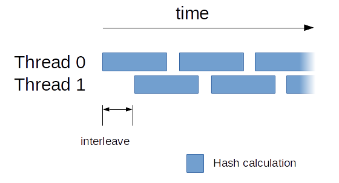

# Tuning Guide

## Content Overview
* [Benchmark](#benchmark)
* [Windows](#windows)
* [Managing GPUs](#managing-GPUs)
* [NVIDIA Backend](#nvidia-backend)
  * [Choose Value for `threads` and `blocks`](#choose-value-for-threads-and-blocks)
  * [Add more GPUs](#add-more-gpus)
* [AMD Backend](#amd-backend)
  * [Choose `intensity` and `worksize`](#choose-intensity-and-worksize)
  * [Two Threads per GPU](two-threads-per-GPU)
  * [Interleave Tuning](interleave-tuning)
  * [disable comp_mode](#disable-comp_mode)
  * [Auto-tune](#auto-tune)
  * [Change the scratchpad memory pattern](change-the-scratchpad-memory-pattern)
  * [Increase Memory Pool](#increase-memory-pool)
  * [Scratchpad Indexing](#scratchpad-indexing)
* [CPU Backend](#cpu-backend)
  * [Choose Value for `low_power_mode`](#choose-value-for-low_power_mode)

## Benchmark
You can benchmark the miner in two ways:
  - Edit `config.txt` and set `verbose_level` to 4 and `h_print_time` to 30 and start the miner. You will see hash report each 30 seconds.
  - Start the miner with the cli option `--benchmark BLOCKVERSION`. The miner will not connect to any pool and performs a 60sec performance benchmark with all enabled backends.

## Windows
"Run As Administrator" prompt (UAC) confirmation is needed to use large pages on Windows 7.
On Windows 10 it is only needed once to set up the account to use them.
Disable the dialog with the command line option `--noUAC`

### Managing GPUs

To turn on and off a GPU you need to add/remove config set to `GPU_threads_conf`.
`index` is the number of the GPU, the index order not follow the order from `nvidia-smi` or the order shown in windows.

```
"GPU_threads_conf" :
[
    { "index" : 0, "threads" : 17, "blocks" : 60, "bfactor" : 0, "bsleep" :  0,
      "affine_to_cpu" : false, "sync_mode" : 3, "mem_mode" : 1,
    },
    { "index" : 1, "threads" : 17, "blocks" : 60, "bfactor" : 0, "bsleep" :  0,
      "affine_to_cpu" : false, "sync_mode" : 3, "mem_mode" : 1,
    },
],
```

## NVIDIA Backend

By default the NVIDIA backend can be tuned in the config file `nvidia.txt`

### Choose Value for `threads` and `blocks`

The optimal values for the `threads` and `blocks` parameters in `nvidia.txt` depend on your GPU model and selected mining algorithm.
For all GPU's with a compute capability `>=2.0` and `<6.0` there is a restriction of the amount of vRAM that can be used for the mining algorithm.
The maximum vRAM that can be used must be less than 2GB (e.g. GTX TITAN) or 1GB (e.g. GTX 750-TI).
The amount of vRAM used for mining can be changed with `"threads" : T, "blocks : B"`.
  - `T` = threads used per block
  - `B` = CUDA blocks started (should be a multiple of the multiprocessors `M` on the GPU)

For the 2GB limit the equations must be full filled: `T * B * 2 <= 1900` and ` B mod M == 0`.
The value `1900` is used because there is a little data overhead for administration.
The GTX Titan X has 24 multiprocessors `M`, this means a valid and good starting configuration is `"threads" : 16, "blocks : 48"`
and full fill all restrictions `16 * 48 * 2 = 1536` and `48 mod 24 = 0`.

The memory limit for NVIDIA Pascal GPUs is `16` GiB if the newest CUDA driver is used.

## AMD Backend

By default the AMD backend can be tuned in the config file `amd.txt`

### Choose `intensity` and `worksize`

Intensity means the number of threads used to mine. The maximum intensity is GPU_MEMORY_MB / 2 - 128, however for cards with 4GB and more, the optimum is likely to be lower than that.
`worksize` is the number of threads working together to increase the miner performance.
In the most cases a `worksize` of `16` or `8` is optimal.


### Two Threads per GPU

Some AMD GPUs can mine faster on some mining algorithms if two threads are using the same GPU.
If you have `amd.txt` config with one `index` entry per GPU - duplicate these entries to run 2 threads per GPU.
*Notice*:  Keep in mind that the memory usage on the GPU will also double - therefore adjust your `intensity` by hand.

Example of 2-threaded config:
```
"GPU_threads_conf" :
[
    { "index" : 0, "intensity" : 1000, "worksize" : 8, "affine_to_cpu" : false,
      "strided_index" : true, "mem_chunk" : 2, "unroll" : 8, "comp_mode" : true,
      "interleave" : 40
    },
    { "index" : 0, "intensity" : 1000, "worksize" : 8, "affine_to_cpu" : false,
      "strided_index" : true, "mem_chunk" : 2, "unroll" : 8, "comp_mode" : true,
      "interleave" : 40
    },
],

"platform_index" : 0,
```

### Interleave Tuning

**Note 1:** Interleaving is available for AMD GPUs only.

**Note 2** Interleaving has effect only when 2+ threads are used per each GPU.

Interleave controls when a worker thread is starting to calculate hashes if two worker threads are used to utilize one GPU. This parameter is designed to reduce total idle periods of GPU while mining

 

**1.Reading and understanding the log:**

`OpenCL Interleave 0|0: 265/1372.30 ms - 40.1`  
`OpenCL Interleave 0|1: 125/1330.10 ms - 40.2`  
`OpenCL Interleave 0|0: 74/1323.67 ms - 40.2`  
`OpenCL Interleave 0|1: 43/1312.01 ms - 40.2`  
`OpenCL Interleave 0|1: 16/1283.20 ms - 40.2`  

Reads as:
`OpenCL Interleave GPU ID|Thread ID: last delay/average calculation time per hash bunch - interleave value`


**2.Do I need to adjust it?**  
In general, interleaving can be used as representation how 2-threading works with your GPU at current set of settings (including GPU power profile, miner settings, drivers). And default value `"interleave" : 40` in `amd.txt` works good in most cases.  

2.1 Optimal setup: After you started mining you have `last delay` value reduced over time to minimum possible value and stays at it. The best scenario is when `last delay` value settled around 10-15 and interleave messages appear rarely. The reported hashrate will be close to max. of GPU capabilities.  

2.2 Not optimal setup: After you started mining you have `last delay` value reducing over time and jumping back to high values, or rising after the start of mining. The reported hashrate will be lower compared to max. possible.  

**3.Adjusting Interleaving and optimizing hashrate**  
**Note:** setting `interleave` value in amd.txt higher than 50 has no practical sense

If you faced situation described in 2.2 then you need to keep in mind that this can be caused by several possible reasons, so treat them accordingly and start miner after each attempt and check logs and hashrate:

- Miner misconfiguration 1: Adjust "interleave" in amd.txt by couple points +/-  
- Miner misconfiguration 2: Adjust "intensity" in amd.txt by setting lower value (multiple to "worksize" value)  
- GPU overclock: Reduce overclock/overvoltage values of GPU memory and GPU core  
- Drivers issue: Try [reinstalling your drivers](https://www.amd.com/en/support) (there are 3 possible options to try: blockchain drivers, v18.6.1, or newest version)
​

### disable comp_mode

`comp_mode` means compatibility mode and removes some checks in compute kernel those takes care that the miner can be used on a wide range of AMD/OpenCL GPU devices.
To avoid miner crashes the `intensity` should be a multiple of `worksize` if `comp_mode` is `false`.

### Auto tune

**Note:** This feature is available for AMD gpus only.

Auto-tuning feature may help you to speed up seek process of finding optimal intensity for your GPU (vs manual check, in case if you want to compare autogenerated intensity with the most performing value).

When set, miner will perform several (defined by user) rounds per each intensity check of given range. When setting number of rounds - keep in mind that you want to have a balance of speed and reliability of the checking.

After setting number of checks per intensity value, you will need to set ceiling value after which the miner will stop checking intensity values.

**1.Enabling and configuring auto-tune**  
Navigate to amd.txt config file in miner's folder, find (in the bottom part) parameter "auto_tune" : 0, and set it to "auto_tune" : 6, (6-10 rounds per intensity value suits most cases.)
Set autogenerated value of "intensity" : X, for each thread in amd.txt to slightly higher level (e.g. from 890 to 1000)
Start xmr-stak.exe

**2. Reading and understanding the log**  
Here is an example of log for 1 GPU with 2 threads (your values will vary):
`OpenCL 0|0: auto-tune validate intensity 848|840`  
`OpenCL 0|1: auto-tune validate intensity 848|840`  
`OpenCL 0|0: auto-tune validate intensity 856|848`  
`OpenCL 0|1: auto-tune validate intensity 856|848`  
Reads as: `OpenCL GPU ID|Thread ID auto-tune validate intensity Currently checked value|last succesfully checked value`

After the checking, you will see

`OpenCL 0|0: lock intensity at 896`  
`OpenCL 0|1: lock intensity at 896`  
Write down these locked intensity values and stop miner.

**3. Finalizing setup**  
Set "auto_tune" value (step 1.1) in `amd.txt` back to "auto_tune" : 0,  
Enter locked intensity values from step 2.  
Start miner.  

### Change the scratchpad memory pattern

By changing `strided_index` to `2` the number of contiguous elements (a 16 byte) for one miner thread can be fine tuned with the option `mem_chunk`.


### Increase Memory Pool

By setting the following environment variables before the miner is started OpenCl allows the miner to more threads.
This variables must be set each time before the miner is started else it could be that the miner can not allocate enough memory and is crashing.

```
export GPU_FORCE_64BIT_PTR=1
export GPU_MAX_HEAP_SIZE=100
export GPU_MAX_ALLOC_PERCENT=100
export GPU_SINGLE_ALLOC_PERCENT=100
```

*Note:* Windows user must use `set` instead of `export` to define an environment variable.

### Scratchpad Indexing

The layout of the hash scratchpad memory can be changed for each GPU with the option `strided_index` in `amd.txt`.
Try to change the value from the default `true` to `false`.

## CPU Backend

By default the CPU backend can be tuned in the config file `cpu.txt`

### Choose Value for `low_power_mode`

The optimal value for `low_power_mode` depends on the cache size of your CPU, and the number of threads.

The `low_power_mode` can be set to a number between `1` to `5`. When set to a value `N` greater than `1`, this mode increases the single thread performance by `N` times, but also requires at least `2*N` MB of cache per thread. It can also be set to `false` or `true`. The value `false` is equivalent to `1`, and `true` is equivalent to `2`.

This setting is particularly useful for CPUs with very large cache. For example the Intel Crystal Well Processors are equipped with 128MB L4 cache, enough to run 8 threads at an optimal `low_power_mode` value of `5`.
